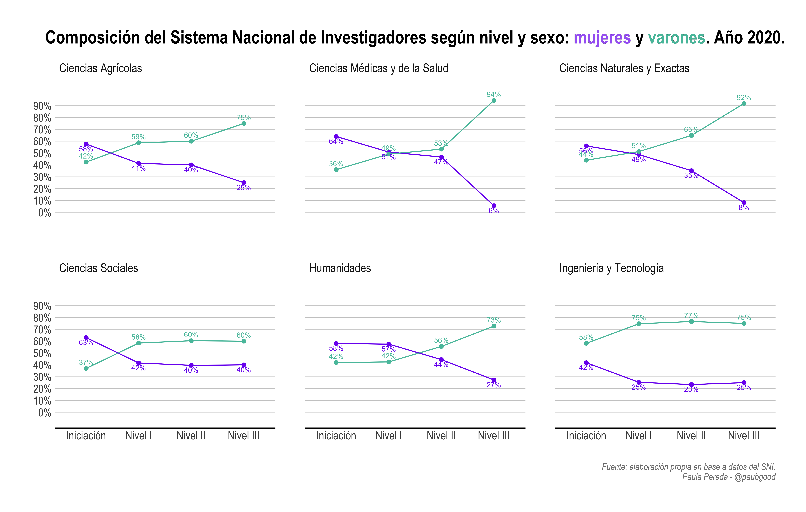

# Composición del Sistema Nacional de Investigadores (SNI) según sexo, nivel y área.

Aclaraciones: 

- La base fue obtenida en tres etapas: en primer lugar, se extrajeron los datos de los resultados de la última convocatoria del SNI, luego, se _scrappearon_ los datos del SNI sin actualizar por la última convocatoria y por último, se corrigió la base sin actualizar con los resultados de la nueva convocatoria (es decir, ascensos de nivel e ingresos al Sistema). Este método puede inducir a alguna diferencia con la base que mantiene la ANII.
- Dado que ninguna de las dos bases obtenidas presentaba la variable sexo, se empleó un algoritmo clasificador según el nombre de los investigadores contenido en el paquete [genderizeR](https://github.com/kalimu/genderizeR). La congruencia de este proceso fue chequeada manualmente. 
- Agradezco a [Mateo Barletta](https://github.com/MateoBarletta) por su aporte _scrappeando_ los datos del SNI. 
